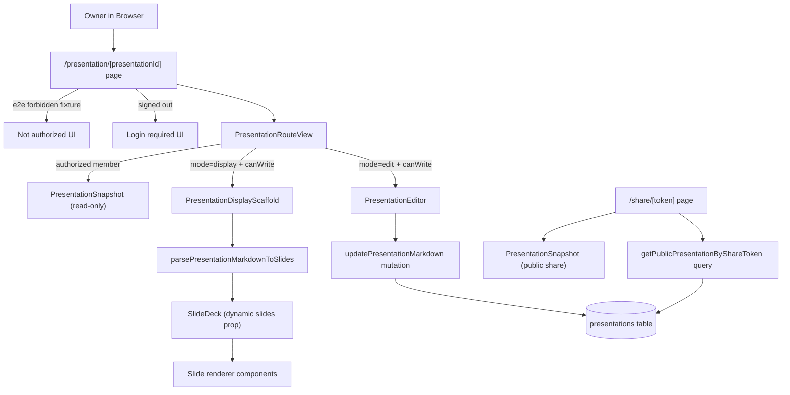
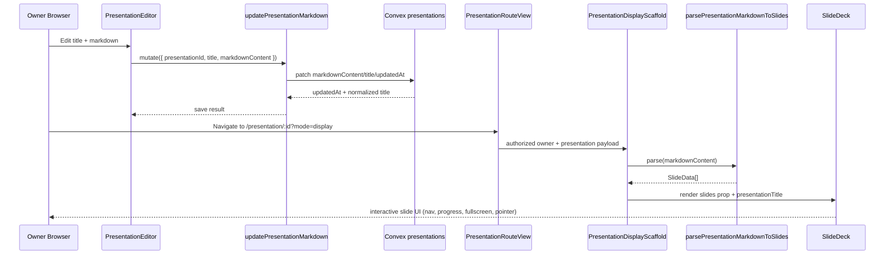

# PF-31: Display a Presentation Saved by the User

## Problem and Context

PF-31 closes the gap between persisted markdown and slide rendering on the protected presentation route. Before this change, saved `markdownContent` could be edited and persisted, but owner display mode did not render that saved content through the slide system.

The implementation introduces a deterministic markdown-to-slides adapter, routes owners into explicit edit/display modes, and keeps member/share access behavior stable.

---

## Architecture Overview



---

## File Structure

### Frontend: `src/`

```text
src/
├─ app/
│  ├─ presentation/[presentationId]/page.tsx        # Parses mode query, guards signed-out/forbidden fixtures, mounts route view
│  └─ share/[token]/page.tsx                        # Existing public snapshot route (unchanged PF-31 behavior)
├─ components/slides/
│  └─ slide-deck.tsx                                # Accepts dynamic SlideData[] input while preserving controls/animation
├─ config/
│  └─ routes.ts                                     # Adds presentationDisplayById(...)
├─ features/presentations/components/
│  ├─ presentation-route-view.tsx                   # Branches edit/display/member states from route-access union
│  ├─ presentation-display-scaffold.tsx             # Parses saved markdown, renders deck or fallback states
│  ├─ presentation-editor.tsx                       # Save flow + "Display saved slides" navigation
│  └─ presentation-snapshot.tsx                     # Existing read-only markdown snapshot view
├─ lib/
│  └─ presentation-markdown-to-slides.ts            # Markdown -> SlideData[] parser with safe fallback behavior
└─ tests/
   ├─ unit/presentation-markdown-to-slides.test.ts # Parser behavior and resilience tests
   ├─ integration/presentation-authorization.test.ts# Authorization payload checks incl title/markdown/updatedAt
   └─ e2e/smoke.spec.ts                             # Login/forbidden/share/display-mode route smoke checks
```

### Backend: `convex/`

```text
convex/
├─ presentations/
│  ├─ queries.ts                                    # getPresentationRouteAccess + getPublicPresentationByShareToken
│  └─ mutations.ts                                  # updatePresentationMarkdown persists title/markdown/updatedAt
└─ lib/
   └─ permissions.ts                                # workspace membership and owner/member enforcement
```

PF-31 does not add new Convex schema fields; it consumes existing `title`, `markdownContent`, and `updatedAt`.

---

## Route and Auth Flow (Edit vs Display vs Member vs Share)

- `src/app/presentation/[presentationId]/page.tsx` normalizes `searchParams.mode` to `'edit' | 'display'` (default `'edit'`).
- Signed-out users are blocked before client query execution and see login-required UI.
- `PresentationRouteView` queries `getPresentationRouteAccess` and exhaustively handles:
  - `unauthenticated` -> login prompt
  - `forbidden` -> not authorized message
  - `not_found` -> not found message
  - `authorized`:
    - `canWrite && mode === 'edit'` -> `PresentationEditor`
    - `canWrite && mode === 'display'` -> `PresentationDisplayScaffold`
    - `!canWrite` (member) -> `PresentationSnapshot` read-only view
- Public `/share/[token]` remains separate and always renders snapshot content when share token is valid.

---

## Data Flow: Saved Markdown to Rendered Slides



---

## Key Components and Responsibilities

- `parsePresentationMarkdownToSlides`:
  - Splits slides on `---`.
  - Supports explicit `type:` markers for `title|content|image|split|quote|three-column|highlight`.
  - Infers slide type from heading/bullets/quotes/images when type marker is absent.
  - Never throws to callers; returns safe fallback content slides when sections are malformed.
- `SlideDeck`:
  - Accepts optional `slides` prop, defaulting to static demo slides for backward compatibility.
  - Preserves keyboard/touch navigation, fullscreen, pointer mode, progress/nav controls, and exhaustive slide-type rendering.
- `PresentationDisplayScaffold`:
  - Uses saved markdown only (not unsaved editor draft).
  - Handles display states: empty markdown, parse failure, zero slides, successful render.
  - Provides navigation back to edit mode and dashboard.
- `PresentationEditor`:
  - Persists title/markdown with mutation.
  - Adds explicit action to open owner display mode via `routes.presentationDisplayById(...)`.

---

## Testing and Validation Notes

- Unit: `src/tests/unit/presentation-markdown-to-slides.test.ts`
  - Blank markdown -> empty array.
  - Heading + bullets -> content slide mapping.
  - `---` delimiter -> stable ids and valid types.
  - Malformed markdown -> non-throwing safe output.
- Integration: `src/tests/integration/presentation-authorization.test.ts`
  - Confirms route-access payload for owner/member includes `title`, `markdownContent`, `updatedAt`.
  - Keeps forbidden/member/share token behavior expectations.
- E2E smoke: `src/tests/e2e/smoke.spec.ts`
  - Signed-out deck route and display-mode route show login prompt.
  - Unauthorized fixture shows explicit forbidden UI.
  - Share token snapshot route still renders as expected.

---

## Trade-offs, Known Limitations, and Next Steps

- Display rendering is owner-only on protected route; members and share links still use snapshot markdown view (intentional scope control).
- Parser supports a pragmatic markdown subset and heuristic type inference; complex markdown structures may collapse into generic content slides.
- `SlideDeck` breadcrumb parent-topic logic is optimized for default demo slides; dynamic decks fall back to simpler breadcrumb structure.
- Slide parser currently runs client-side in display scaffold; server-side pre-parse/caching could reduce repeated parsing for large decks.

Next steps:
- Add a share-display experience (slide rendering for public links) if product requires parity with owner display mode.
- Expand parser contract for richer layouts (speaker notes, per-slide metadata, advanced image/columns syntax).
- Add dedicated E2E for signed-in owner display rendering with real saved markdown content.

---

## Deployment Steps

1. Deploy frontend changes (Next.js route/view/parser/deck wiring).
2. Deploy Convex functions if branch includes query/mutation changes (`npx convex deploy`) even though PF-31 introduces no schema migration.
3. Verify environment has Clerk + Convex variables already used by protected routes.
4. Run PF-31 validation set before merge:
   - `yarn test src/tests/unit/presentation-markdown-to-slides.test.ts`
   - `yarn test src/tests/integration/presentation-authorization.test.ts`
   - `yarn test:e2e --grep "presentation|display|share|unauthorized"`

`[TODO: verify]` none.
